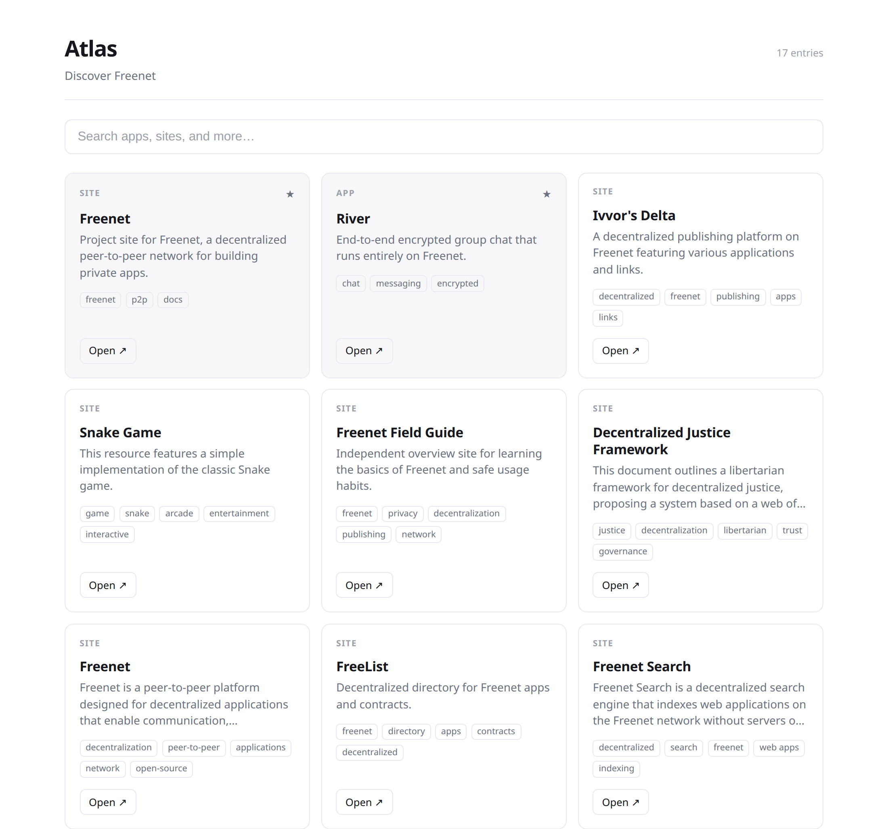

# Atlas

Atlas is a proposed **decentralized discovery layer for Freenet**: a way to
describe, index, search, recommend, review, and discover Freenet content and
applications without relying on a centralized search engine or recommendation
service.

Rather than imposing a single canonical index or ranking, Atlas provides a
framework for publishing signed metadata and building many competing,
pluralistic discovery systems on top of it. Users stay in control of which
analyzers, indexes, curators, and ranking policies they trust.

## UI

A first version of the Atlas browsing experience is built and running on
Freenet: open it, search, and open what you find, with no setup or learning
curve. The screenshot below is the live UI. Its entries are gathered
automatically by a crawler that describes each resource with an LLM.

## Status

Atlas is an early-stage, work-in-progress proposal. Goals, architecture,
descriptor schemas, and naming are all open for discussion and likely to
change.

See [PROPOSAL.md](PROPOSAL.md) for the full RFC.
